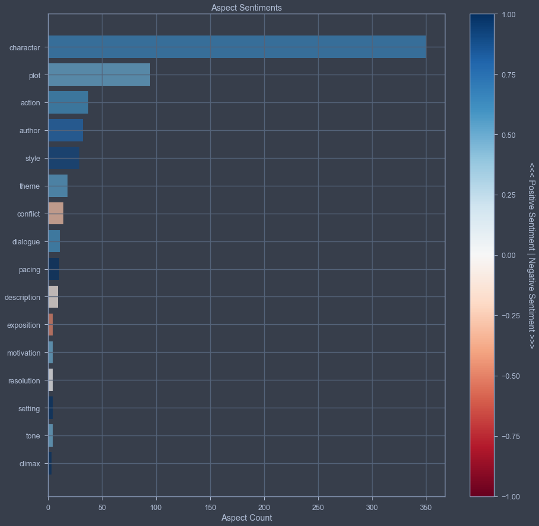
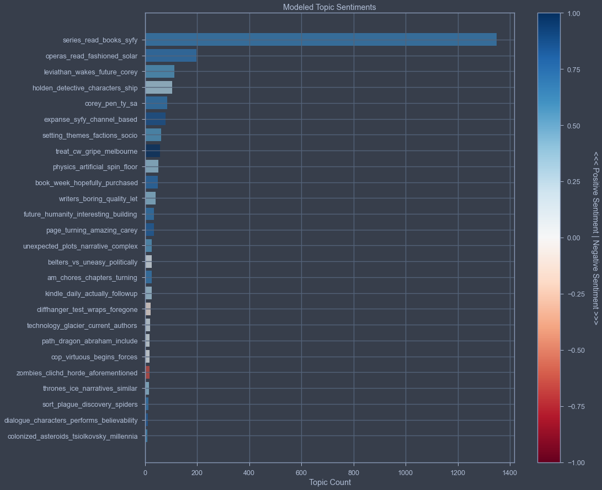

# Combined Aspect-Based and Topic-Based Sentiment Analysis of Book Reviews

## Overview

This project is a combined aspect-based and topic-based sentiment analysis on book reviews, using KeyBERT and BERTopic. It combines two pipelines, both guided by the same set of keywords representing literary elements (character, plot, setting, theme, etc.). This is a natural progression from a previous project comparing Latent Dirichlet Allocation (LDA) and Non-negative Matrix Factorization (NMF) topic modeling methods on [healthcare transcription text](https://github.com/DarrellS0352/Healthcare-Text-Topic-Modeling). This method applies the more modern approach of embedding-based BERTopic with a sentiment layer on top. Combining both methods finds interesting insights that either approach alone would miss.

## Data and Preprocessing

The data is 1,540 reviews for a single book, Leviathan Wakes by James S.A. Corey. The original pipeline would handle multiple books but this project uses one for development and presentation purposes. This is a book that I've personally read, rated, and got recommendations for in my [Neural-Collaborative Filtering Book Recommender](https://github.com/DarrellS0352/Neural-Collaborative-Filtering-Book-Recommendation-System) project.

The data cleaning pipeline started with sentence-splitting via spaCy, then unicode normalization, HTML/URL/emoji removal, contraction expansion, whitespace cleanup, and lowercasing. This turned the 1,540 reviews into about 6,900 sentences.

## Aspect-Based Sentiment Analysis

This pipeline consisted of KeyBERT plus a custom `KeyphraseCountVectorizer` that extracts candidate keyphrases using five part-of-speech patterns from the work of Banjar et al. (2021). The five patterns are: adjective > noun(s), adverb > adverb > noun(s), adverb > adjective > noun(s), adverb > verb > noun(s), verb > noun(s). The extraction is guided by seeding the 20 literary-element keywords, with a diversity setting of 0.7 to reduce redundant/overlapping phrases. Each keyphrase is split into a descriptive portion and a noun portion. The noun portion is lemmatized to produce a normalized "aspect" (example: "characters" to "character"). Then, each keyphrase (~2,500) receives a sentiment score from a pretrained RoBERTa sentiment model. The results are aggregated by aspect and filtered down to just the 20 seed-keyword aspects for the final table.

| Aspect | Mentions | % of Total | Mean Sentiment |
|---|---|---|---|
| character | 350 | 55.8% | 0.665 |
| plot | 94 | 15.0% | 0.510 |
| action | 37 | 5.9% | 0.621 |
| author | 32 | 5.1% | 0.804 |
| style | 29 | 4.6% | 0.920 |
| theme | 18 | 2.9% | 0.550 |
| conflict | 14 | 2.2% | -0.293 |
| dialogue | 11 | 1.8% | 0.607 |
| pacing | 10 | 1.6% | 0.999 |
| description | 9 | 1.4% | -0.085 |
| exposition | 4 | 0.6% | -0.497 |
| motivation | 4 | 0.6% | 0.497 |
| resolution | 4 | 0.6% | 0.000 |
| setting | 4 | 0.6% | 0.998 |
| tone | 4 | 0.6% | 0.497 |
| climax | 3 | 0.5% | 0.999 |

*Aspect sentiment scores, colored by mean sentiment (blue = positive, red = negative). "Character" dominates by volume; "conflict" is the only frequently-mentioned aspect with negative sentiment.*

## Guided Topic Modeling Sentiment Analysis

The main focus of this pipeline is BERTopic with `all-MiniLM-L6-v2` sentence-transformer embeddings, which was selected for its out-of-the-box performance that removed the need to train my own model. Stopwords were intentionally not removed before embedding because they provide context to transformer models. Stopword removal occurs downstream via `CountVectorizer` instead. The same diversity setting (0.7) and 20 seed keywords were used to guide topic discovery. Setting `nr_topics='auto'` resulted in 26 topics, excluding outlier sentences.

Sentiments were scored by sentence instead of keyphrase (like the aspect pipeline) and then aggregated per topic.

Full topic table (26 topics)

| Topic | Count | % of Total | Mean Sentiment |
|---|---|---|---|
| series_read_books_syfy | 1350 | 53.8% | 0.672 |
| operas_read_fashioned_solar | 198 | 7.9% | 0.720 |
| leviathan_wakes_future_corey | 113 | 4.5% | 0.558 |
| holden_detective_characters_ship | 104 | 4.1% | 0.312 |
| corey_pen_ty_sa | 85 | 3.4% | 0.717 |
| expanse_syfy_channel_based | 79 | 3.1% | 0.871 |
| setting_themes_factions_socio | 63 | 2.5% | 0.561 |
| treat_cw_gripe_melbourne | 57 | 2.3% | 0.998 |
| physics_artificial_spin_floor | 51 | 2.0% | 0.372 |
| book_week_hopefully_purchased | 50 | 2.0% | 0.759 |
| writers_boring_quality_let | 40 | 1.6% | 0.399 |
| future_humanity_interesting_building | 35 | 1.4% | 0.713 |
| page_turning_amazing_carey | 34 | 1.4% | 0.822 |
| unexpected_plots_narrative_complex | 27 | 1.1% | 0.554 |
| belters_vs_uneasy_politically | 27 | 1.1% | 0.095 |
| am_chores_chapters_turning | 26 | 1.0% | 0.690 |
| kindle_daily_actually_followup | 26 | 1.0% | 0.306 |
| cliffhanger_test_wraps_foregone | 22 | 0.9% | -0.091 |
| technology_glacier_current_authors | 19 | 0.8% | 0.153 |
| path_dragon_abraham_include | 18 | 0.7% | 0.113 |
| cop_virtuous_begins_forces | 17 | 0.7% | 0.060 |
| zombies_clichd_horde_aforementioned | 17 | 0.7% | -0.645 |
| thrones_ice_narratives_similar | 16 | 0.6% | 0.375 |
| sort_plague_discovery_spiders | 13 | 0.5% | 0.691 |
| dialogue_characters_performs_believability | 12 | 0.5% | 0.832 |
| colonized_asteroids_tsiolkovsky_millennia | 10 | 0.4% | 0.595 |

*Topic sentiment scores from the guided BERTopic model, colored by mean sentiment. The dominant meta-topic (`series_read_books_syfy`) anchors over half of all sentences; `zombies_clichd_horde_aforementioned` and `cliffhanger_test_wraps_foregone` are the only topics with negative mean sentiment.*

## Key Findings

Both methods converge on "character" from independent mechanisms. The aspect-based analysis shows "character" at 55.8% of mentions with strong positive sentiment (0.665). Topic-based analysis also found multiple character-centric topics like "holden_detective_characters_ship" and "dialogue_characters_performs_believability". The dominant meta-topic also focuses on series/characters. Both methods agreeing on this serves as a form of validation.

The "conflict" connection is flagged by the aspect-based pipeline as the only frequently-mentioned literary element with negative sentiment (-0.293 with 14 mentions). On its own it is a number without context. The topic-based pipeline also found two specific negative-sentiment topics: "zombies_clichd_horde_aforementioned" (-0.645, most negative topic) and "cliffhanger_test_wraps_foregone" (-0.091). Combining the data points from both pipelines suggests readers are referring to "conflict" as genre-trope criticisms like cliché threats and cliffhanger pacing instead of the in-story conflict. Neither pipeline would have discovered this connection on its own.

Each method serves a distinct purpose for a reader or for a writer/producer. The aspect-based pipeline provides a standard scorecard to compare between books (outputting scores for "character", "plot", "pacing", etc.). You get a score for the same 20 categories for any book. The topic pipeline provides sentiments on a book's actual content. Outputs with sentiment scores like "leviathan_wakes_future_corey", "holden_detective_characters_ship", and "expanse_syfy_channel_based" give meaning to what people are saying about this specific book.

If this combined pipeline is scaled to the book catalog from my Neural Collaborative Filtering project, the aspect scores are a standardized scoring method for cross-book comparison and the topic analysis becomes a unique book content report.

An interesting detail worth noting is some topics do repeat the seed keywords. For example, "setting_themes_factions_socio" includes "setting" and "theme". However, most don't. This suggests the model found genuinely new information beyond just rediscovering the literary element seed words. This is evidence the two pipelines aren't redundant.

## Extensions / What I'd Do Differently

This project was completed during my Master's program. With my current experience, there are a few things I'd approach differently:

- Scale to the full Neural Collaborative Filtering project catalog. Running this across multiple books rather than a single development book would test the standardized scorecard + unique content report method.
- LLM-based topic labeling. BERTopic's raw topic names (examples: "corey_pen_ty_sa", "treat_cw_gripe_melbourne") can be difficult to interpret. An LLM could generate human-readable topic summaries by taking each topic's top words and representative sentences as input.
- Confidence thresholds. Some aspects had small samples, meaning their sentiment scores were noisy. Implementing a minimum sample size or confidence interval would produce more reliable aspect scores.

## References

- Banjar, A., Ahmed, Z., Daud, A., Abbasi, R.A., & Dawood, H. (2021). Aspect-Based Sentiment Analysis for Polarity Estimation of Customer Reviews on Twitter. *Computers, Materials & Continua*, 67(2), 2203-2225. (Source for the part-of-speech extraction patterns used in aspect extraction.)
- [siebert/sentiment-roberta-large-english](https://huggingface.co/siebert/sentiment-roberta-large-english) — pretrained sentiment classification model
- [KeyBERT](https://github.com/MaartenGr/KeyBERT) — keyword/keyphrase extraction using BERT embeddings
- [KeyphraseVectorizers](https://github.com/TimSchopf/KeyphraseVectorizers) — part-of-speech pattern-based keyphrase vectorization
- [BERTopic](https://github.com/MaartenGr/BERTopic) — topic modeling with transformer embeddings
- [Sentence-Transformers](https://www.sbert.net/) — sentence embedding models (`all-MiniLM-L6-v2`)
